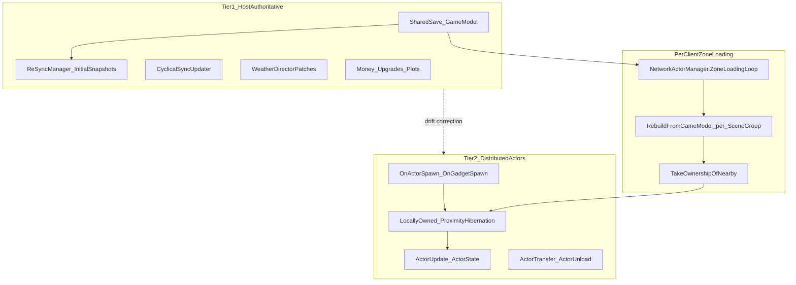
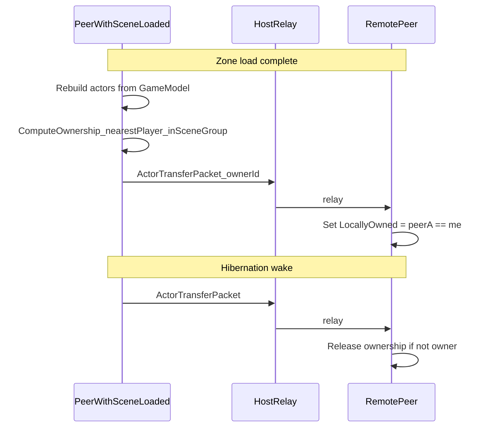

# Object Instance Control Plan (Host / Client)

## Gemini Notes

**No Gemini-authored design notes exist in this repository.** The only "Gemini" reference is a web-crawler block in [Starlight/robots.txt](Starlight/robots.txt). Guidance for this plan comes from:

- [pr_proposal.md](pr_proposal.md) — intended sync behavior (host-delegated resource spawns, anti-duplicate loot, cyclical drift correction)
- Inline code comments in [OnResourceNodeHarvest.cs](SR2MP/Patches/World/OnResourceNodeHarvest.cs) and [ResourceNode.cs](SR2MP/Handlers/ResourceNode/ResourceNode.cs)
- The existing `LocallyOwned` distributed model across actors, gardens, and weather

---

## Current Architecture (Baseline)

SR2MP already uses a **two-tier hybrid**, not pure host authority:



| Concern | Current model | Key files |
|---------|---------------|-----------|
| Who spawns actors? | Whoever triggers vanilla `InstantiateActor` locally | [OnActorSpawn.cs](SR2MP/Patches/Actor/OnActorSpawn.cs) |
| Who simulates physics? | `LocallyOwned = true` peer (unfrozen rigidbody) | [NetworkActor.Core.cs](SR2MP/Components/Actor/NetworkActor.Core.cs) |
| Zone/area loading | Each peer rebuilds actors for **its** loaded `SceneGroup` from shared `GameModel` | [NetworkActorManager.cs](SR2MP/Shared/Managers/NetworkActorManager.cs) L29-98 |
| Ownership transfer | Hibernation wake → `ActorTransferPacket`; hibernation → `ActorUnloadPacket` | [NetworkActor.Core.cs](SR2MP/Components/Actor/NetworkActor.Core.cs) L162-188 |
| Host role | Save owner, UDP relay, join/resync, cyclical world-state broadcast | [Main.cs](SR2MP/Main.cs), [CyclicalSyncUpdater.cs](SR2MP/Components/World/CyclicalSyncUpdater.cs) |
| Anti-duplicate spawn | `ActorSpawnHandler` rejects if `ActorId` already exists | [ActorSpawn.cs](SR2MP/Handlers/Actor/ActorSpawn.cs) L15-18 |
| Actor ID space | Partitioned per player: `ActorIdOffset = 1_000_000` | [GlobalVariables.cs](SR2MP/GlobalVariables.cs) L97 |

**Area-triggered spawning today:** When a player enters a `SceneGroup`, `ZoneLoadingLoop` destroys all local actor GameObjects, re-instantiates models matching `CurrentSceneGroup`, then `TakeOwnershipOfNearby()` (600×1250×600 bounds) claims simulation for nearby actors. Separately, any local gameplay action (vacuum, harvest, reproduction) can spawn new instances via Harmony patches and broadcast `ActorSpawnPacket` through `SendToAllOrServer`.

---

## Known Gaps and Risks

### 1. Resource node spawn inconsistency (duplicate loot risk)

[pr_proposal.md](pr_proposal.md) says clients should **delegate spawns to host**, but [OnResourceNodeHarvest.cs](SR2MP/Patches/World/OnResourceNodeHarvest.cs) explicitly allows **both** host and client to call `SpawnSingleResource` locally. The `RequestSpawn` path in [ResourceNode.cs](SR2MP/Handlers/ResourceNode/ResourceNode.cs) exists as a "legacy fallback" but **no patch currently sets `RequestSpawn = true`**.

### 2. Ownership races (no `OwnerId` enforcement)

`ActorTransferPacket.OwnerId` is serialized but [ActorTransferHandler](SR2MP/Handlers/Actor/ActorTransfer.cs) unconditionally sets `LocallyOwned = false` on all receivers—there is no validation of who should own. When two players are in the same zone, `TakeOwnershipOfNearby()` can cause competing claims.

### 3. No scene-group presence registry

The mod does not track which peers have which `SceneGroup` loaded. Relay logic (e.g., resource nodes when host scene is unloaded) is ad hoc. Spawn authority cannot be assigned deterministically per area.

### 4. Split exploration is a first-class requirement

Slime Rancher 2 players routinely explore different islands/zones. **Full host authority for simulation** would freeze or desync objects in areas only a client has loaded. The codebase already optimizes for this (client-side harvest spawn comment in `OnResourceNodeHarvest`).

---

## Recommended Control Model: Refined Tiered Hybrid

**Do not move to host-controls-all.** Keep distributed simulation for physics-heavy actors, but add **category-specific spawn authority** and **deterministic ownership assignment**.

### Spawn authority by category

| Spawn category | Authority | Rationale |
|----------------|-----------|-----------|
| **Player-initiated** (vacuum release, gadget place, cheat spawn) | Spawning peer owns immediately; broadcast `ActorSpawn` | Low latency; spawner already has scene loaded |
| **Harvest / breakable loot** (resource nodes, weather lightning drops) | **Single authority per event** — host if host has scene loaded, else nearest peer with scene loaded | Prevents duplicate drops; matches `pr_proposal.md` |
| **Ambient / simulation** (garden regrowth, gordo bursts) | Host by default; transfer to waking peer via hibernation (existing `NetworkGarden` pattern) | Timers tied to save state |
| **Zone reload** (SceneGroup enter) | Each peer rebuilds from `GameModel` (no network spawn); ownership assigned after load | Vanilla region system is per-client |
| **Join / resync** | Host `InitialActorsPacket` snapshot | Already implemented |

### Simulation ownership rules (refine existing)



**Proposed ownership algorithm** (replace unconditional release in `ActorTransferHandler`):

1. On `ActorTransferPacket`, set `LocallyOwned = (packet.OwnerId == LocalID)`.
2. If no peer claims within one frame (edge case), fall back to nearest player in that `SceneGroup`.
3. On `TakeOwnershipOfNearby`, only claim actors where **this peer is the nearest connected player** with that `SceneGroup` loaded (requires scene-group presence).

### Scene-group presence registry (new component)

Add a lightweight `ScenePresenceManager`:

- Each peer broadcasts `SceneGroupEnterPacket` / `SceneGroupExitPacket` on zone transitions (hook into existing `WaitForSceneGroupLoad` in [YieldInstructions.cs](SR2MP/YieldInstructions.cs)).
- Host maintains `Dictionary<string playerId, int sceneGroupId>` per connected client.
- Used by: spawn delegation, ownership tie-breaking, cyclical sync filtering (already position-based at 120m in [GlobalVariables.cs](SR2MP/GlobalVariables.cs)).

---

## Architecture Options (Comparison)

### Option A — Refined Tiered Hybrid (Recommended)

- **Spawn:** category rules above
- **Simulate:** nearest peer with scene loaded (`LocallyOwned`)
- **State of record:** host `GameModel` + cyclical/resync correction

| Pros | Cons |
|------|------|
| Supports split exploration | More logic to maintain |
| Low latency for player actions | Requires presence registry |
| Aligns with existing code | Ownership algorithm must be tested under edge cases |

**Best fit for SR2MP** — incremental changes on proven patterns (`NetworkActor`, `NetworkGarden`, `CyclicalSyncUpdater`).

### Option B — Host-Authoritative Spawning + Distributed Simulation

- All spawns go through host approval (`SpawnRequestPacket` → host spawns or assigns ID → `ActorSpawnPacket`).
- Simulation still delegated to nearest peer.

| Pros | Cons |
|------|------|
| Eliminates duplicate spawns at source | Extra round-trip latency on every spawn |
| Single ID allocator | Host must proxy spawns for unloaded scenes (complex) |
| Easier audit trail | Bottleneck when host is in different zone |

**Use selectively** for high-risk categories (loot drops, weather events), not all actors.

### Option C — Full Host Authority

- Host simulates all actors; clients are thin replicas.

| Pros | Cons |
|------|------|
| Simplest consistency model | Unplayable split exploration (host must load all zones) |
| No ownership races | CPU/network cost scales badly |
| | Fights vanilla hibernation system |

**Not recommended** for Slime Rancher 2's open-world design.

### Option D — Deterministic Interest Manager (future)

- Host runs an ownership arbiter: assigns each actor to exactly one peer based on `(sceneGroup, distance, playerId tie-break)`.
- Peers request ownership; arbiter grants/revokes.

| Pros | Cons |
|------|------|
| Eliminates races completely | Largest refactor |
| Testable ownership logic | New packet types and state machine |
| | Overkill unless player count grows |

**Consider if Option A still shows ownership conflicts after testing.**

---

## Implementation Plan

### Phase 1 — Fix high-risk spawn paths (align code with `pr_proposal.md`)

**Resource nodes / weather loot:**

1. Change [OnResourceNodeHarvest.cs](SR2MP/Patches/World/OnResourceNodeHarvest.cs) `Prefix` to:
   - If connected client (not host): block local `SpawnSingleResource`, send `ResourceNodePacket { RequestSpawn = true }` to server.
   - If host with scene loaded: allow local spawn (existing path).
   - If host without scene: relay `RequestSpawn` to client who has node (use presence registry).
2. Mirror pattern for weather loot patches (already host-simulated in [WeatherDirectorPatches.cs](SR2MP/Patches/Weather/WeatherDirectorPatches.cs); verify loot spawn goes through same single-authority gate).

**Files:** `OnResourceNodeHarvest.cs`, `ResourceNode.cs`, weather loot patches.

### Phase 2 — Ownership validation

1. Update [ActorTransferHandler](SR2MP/Handlers/Actor/ActorTransfer.cs): `LocallyOwned = (packet.OwnerId == LocalID)`.
2. Update [TakeOwnershipOfNearby](SR2MP/Shared/Managers/NetworkActorManager.cs) L119-154: only claim when this peer is nearest player in actor's `SceneGroup`.
3. Add conflict guard: if receiving `ActorTransfer` while locally simulating and `OwnerId != LocalID`, freeze rigidbody immediately (already partially done via `HandleOwnershipChange`).

**Files:** `ActorTransfer.cs`, `NetworkActorManager.cs`, `ActorUnload.cs` (review counter-claim logic at L22-32).

### Phase 3 — Scene-group presence registry

1. New packets: `ScenePresencePacket` (playerId, sceneGroupId, entered/exited).
2. New manager: `ScenePresenceManager` on host; local cache on clients.
3. Hook zone transitions in `NetworkActorManager.ZoneLoadingLoop` after `WaitForSceneGroupLoad`.
4. Expose `GetPlayersInSceneGroup(int sceneGroupId)` for spawn delegation and ownership.

**Files:** new `ScenePresenceManager.cs`, new packet + handler, `NetworkActorManager.cs`, `PacketType.cs`.

### Phase 4 — Spawn routing helper (centralize rules)

Add `SpawnAuthority.Resolve(SpawnContext)` used by patches:

```csharp
// Conceptual API
enum SpawnAuthorityMode { LocalImmediate, DelegateToHost, DelegateToSceneOwner }
SpawnAuthorityMode Resolve(SpawnReason reason, int sceneGroupId);
```

Replace ad hoc `SendToAllOrServer` decisions in spawn patches with this helper. Categories map to Option A table above.

**Files:** new `SpawnAuthority.cs`, `OnActorSpawn.cs`, `OnGadgetSpawn.cs`, resource/weather patches.

### Phase 5 — Drift hardening (existing infrastructure)

- Extend [CyclicalSyncUpdater](SR2MP/Components/World/CyclicalSyncUpdater.cs) to include actor count checksum per `SceneGroup` (lightweight sanity check, not full re-spawn).
- On mismatch, trigger targeted `ReSyncManager` actor snapshot for that zone only (reduces full `/resync` need).

---

## Decision Summary

| Question | Recommendation |
|----------|----------------|
| Host controls all spawns? | **No** — only for loot/event spawns prone to duplication |
| Multi-user sync for actors? | **Yes** — keep `LocallyOwned` distributed simulation |
| Who owns objects in an area? | **Nearest peer with that SceneGroup loaded**, arbitrated via `OwnerId` |
| Different architecture? | **Option A now**; escalate to **Option D** only if ownership races persist |

---

## Test Plan

1. **Split zones:** Host on Ranch, client on Rainbow Island — harvest node on island; verify single loot drop, correct node depletion on both.
2. **Same zone:** Two clients vacuum same slime — verify one owner simulates, no duplicate `ActorId`.
3. **Zone transition:** Player enters new `SceneGroup` — verify rebuild, correct ownership claim, no duplicate GameObjects.
4. **Host absent from zone:** Client triggers spawn — verify spawn appears on host after relay (or host receives model update on next cyclical/resync).
5. **Ownership handoff:** Player A leaves 120m sync radius, Player B approaches — verify simulation transfers cleanly.
6. **Reconnect:** Client rejoins — `InitialActorsPacket` + `TakeOwnershipOfNearby` restores correct state.

---

## Key Files to Modify

- [SR2MP/Patches/Actor/OnActorSpawn.cs](SR2MP/Patches/Actor/OnActorSpawn.cs) — spawn broadcast (keep; route through authority helper)
- [SR2MP/Patches/World/OnResourceNodeHarvest.cs](SR2MP/Patches/World/OnResourceNodeHarvest.cs) — **fix delegation mismatch**
- [SR2MP/Handlers/Actor/ActorTransfer.cs](SR2MP/Handlers/Actor/ActorTransfer.cs) — **enforce OwnerId**
- [SR2MP/Shared/Managers/NetworkActorManager.cs](SR2MP/Shared/Managers/NetworkActorManager.cs) — zone loop + ownership claims
- [SR2MP/Components/Actor/NetworkActor.Core.cs](SR2MP/Components/Actor/NetworkActor.Core.cs) — hibernation ownership signals
- [SR2MP/Handlers/ResourceNode/ResourceNode.cs](SR2MP/Handlers/ResourceNode/ResourceNode.cs) — complete `RequestSpawn` flow
- [SR2MP/Components/LandPlots/NetworkGarden.cs](SR2MP/Components/LandPlots/NetworkGarden.cs) — reference pattern for hibernation ownership
- [pr_proposal.md](pr_proposal.md) — design intent to align implementation with
